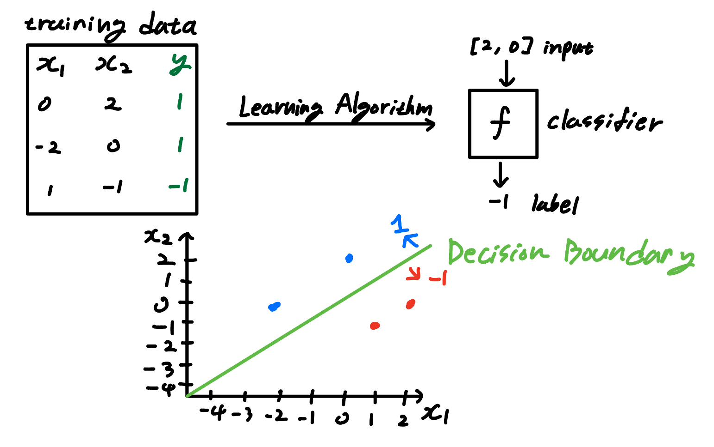
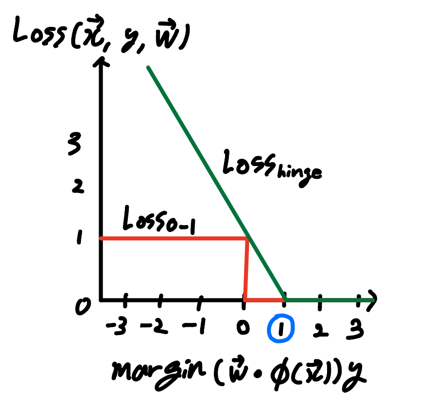
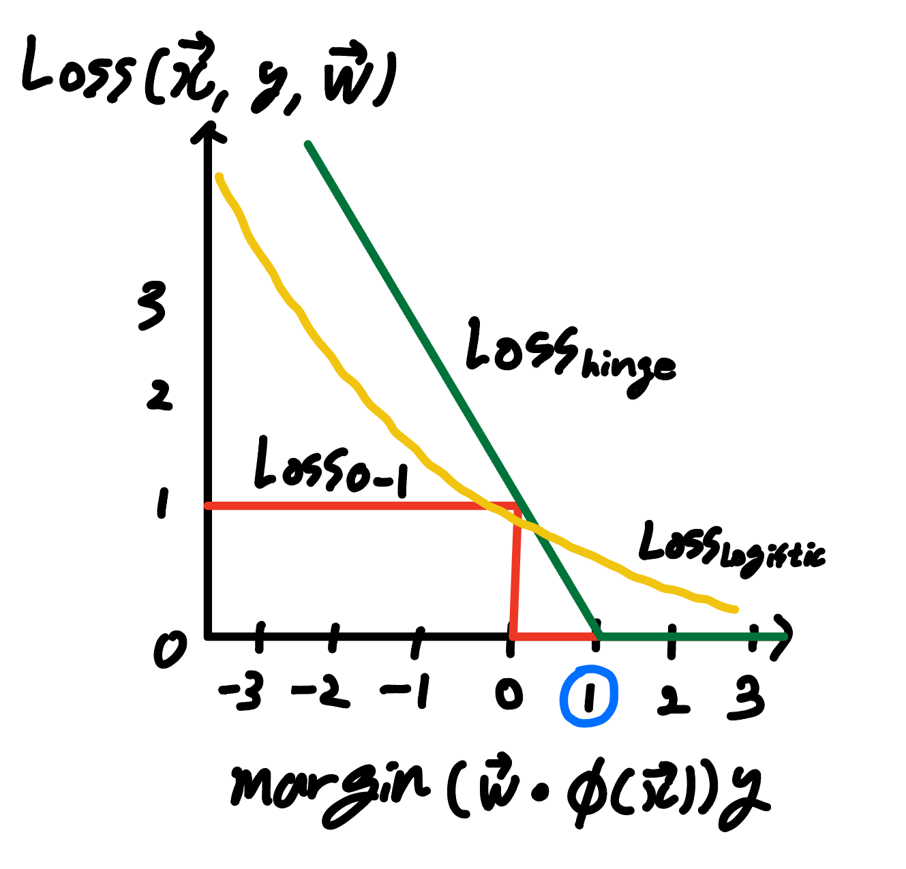
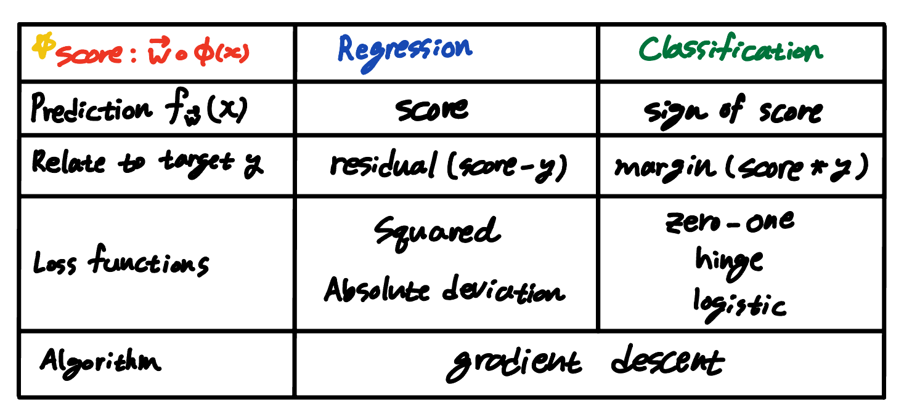

# LectureNote2: CS221 (FALL2021, Stanford)

## Linear Regression

### *The discovery of Ceres*
- 1801: astronomer Piazzi discovered Ceres, made 19 observations of location before it was obscured by the sun
- September 1801: Gauss took Piazzi's data and created a model of Ceres's orbit, makes prediction
- December 7, 1801: Ceres located within 1/2 degree of Gauss's prediction, much more accurate than other astronomers
  - METHOD: Least squares linear regression

### *Linear Regression Framework*
$D_{train} -learningalgorithm\rightarrow prediction [f] \\
\begin{matrix}
x & y \\
1 & 1 \\
2 & 3 \\
4 & 3 \\
\end{matrix}$ 

- Design decisions:
  1. Which predictors are pssible? *hypothesis class*
  2. How good is a predictor? *loss function*
  3. How do we compute the the best predictor? *optimization algorithm*
---
- Hypothesis Class: which predictors?
  - $f(x) = w_1+ w_2x$
  - Vector Notation
  
    $\vec{w}_{weight \ vector} = [w_1, w_2] \\
    \phi_{feature \ extractor} = [1, x]_{feature \ vector} \\
    f_{\vec{w}}(x) = \vec{w} \cdot \phi(x)
    $  
  - Hypothesis Class: $F = \{ \ f_{\vec{w}}(x) : \vec{w} \in \R^2 \ \}$
---
- Loss Function: how good is a predictor?
  - $Loss(x, y, \vec{w}) = (f_{\vec{w}}(x) - y)^2_{ \ \ \ squared \ loss}$
    - residual: $|f_{\vec{w}}(x) - y|$
  - $TrainLoss(\vec{w}) = \frac{1}{|D_{train}|}\sum_{(x,y)\in D_{train}}{Loss(x,y,\vec{w})}$
---
- Optimization Algorithm: how to compute best?
  - Goal: $min_{\vec{w}} \ TrainLoss(\vec{w})$
  - Definition: gradient
    - The gradient $\nabla_{\vec{w}} TrainLoss(\vec{w})$ is the direction that increases the training loss the most
  - Algorithm: gradient descent
    - Initialize $\vec{w}$ = [0, ... , 0]
    - For t = 1, ..., T: epochs
      - $\vec{w} \leftarrow \vec{w} - \eta_{ \ step \ size} \nabla_{\vec{w}} TrainLoss(\vec{w})$
    - initial weight = 0
    - we want to find the weight vector that minimizes the value of TrainLoss function
    - update weghit vector by going to the direction that decreases the TrainLoss function's value by substracting gradient
---
- Computing the gradient
  - $\nabla_{\vec{w}} TrainLoss(\vec{w}) = \frac{1}{|D_{train}|}\sum_{(x,y)\in D_{train}}2(\vec{w} \cdot \phi(x) - y) \ \phi(x)$ = $\frac{1}{|D_{train}|}\sum_{(x,y)\in D_{train}}2(residual) \ \phi(x)$
  - if (prediction = target) $\rightarrow$ gradient = 0
  - if gradient at the end of iteration be 0, it means the gradient descent has converged
---

## Linear Classification

- Design decisions:
  1. Which classifiers are possible? *hypothesis class*
  2. How good is a classfier? *loss function*
  3. How do we compute the best classifier? *optimization algorithm*
- An example linear classifier
  - $f(\vec{x})$ = sign$([-0.6, 0.6] \cdot [x_1, x_2] \ )$ = sign($\vec{w} \cdot \phi(\vec{x})$)
  - sign($z$) = $\begin{cases} 
    +1 &  (z > 0) \\
    -1 &  (z < 0) \\
    0 &  (z = 0)
  \end{cases}$
  - if the angle between $\vec{w}$ and $\phi(\vec{x})$ is **acute**, the sign of the dot product of these two is +
  - if the angle between $\vec{w}$ and $\phi(\vec{x})$ is **obtuse**, the sign of the dot product of these two is -
  - if the angle between $\vec{w}$ and $\phi(\vec{x})$ is **perpendicular**, the dot product of these two is 0 $\rightarrow$ **Decision Boundary**
  - $\therefore$ linear classifier labels the inputs according to the angle of $\phi(\vec{x})_{input}$ with respect to $\vec{w}_{weight \ vector}$
---
- Hypothesis Class: which classifiers?
  - General binary classifier: $f_{\vec{w}}(\vec{x})$ = sign($\vec{w} \cdot \phi(x)$)
  - Hypothesis class: $F = \{f_{\vec{w}}(\vec{x}) : \vec{w} \in \R^2\}$
---
- Loss Function: how good is a classifier?
  - $Loss_{0-1}(\vec{x}, y, \vec{w}) = 1[f_{\vec{w}}(\vec{x}) \neq y]_{ \ \ \ zero-one \ loss}$
    - $Loss_{0-1}(\vec{x}, y, \vec{w})$ = $\begin{cases} 
    1 &  (f_{\vec{w}}(\vec{x}) \neq y) \\
    0 &  (f_{\vec{w}}(\vec{x}) = y) 
  \end{cases}$

---
- Score and Margin
  - predicted label: $f_{\vec{w}}(\vec{x})$ = sign($\vec{w} \cdot \phi(\vec{x})$)
  - target label: $y$
  - Defition: score
    - The score on an example ($x, y$) is $\vec{w} \cdot \phi(\vec{x})$, how **confident** we are in predicting
    - *raw output of the model before applying a decision threshhold*
  - Definition: margin
    - The margin on an example ($x, y$) is $(\vec{w} \cdot \phi(\vec{x}))y$, how **correct** our prediction is
    - $positive \rightarrow correct$
    - $negative \rightarrow incorrect$
    - |margin| = distance from the decision boundary
  - $Loss_{0-1}(\vec{x}, y, \vec{w}) = 1[f_{\vec{w}}(\vec{x}) \neq y]$ = $1[margin \leq \ 0]$ = $\begin{cases} 
    1 &  (margin \leq \ 0) \\
    0 &  (margin > \ 0) 
  \end{cases}$
  ---
  - Optimization Algorithm: how to compute best?
    - $\nabla_{\vec{w}} TrainLoss(\vec{w}) = \sum_{(x,y)\in D_{train}} \nabla Loss_{0-1}(\vec{x}, y, \vec{w})$
    - $\nabla Loss_{0-1}(\vec{x}, y, \vec{w})$ = $\nabla [(\vec{w} \cdot \phi(\vec{x})) \ y \leq \ 0]$
    - $\nabla Loss_{0-1}(\vec{x}, y, \vec{w})$ is zero almost everywhere! $\rightarrow$ we can't use gradient descent 
    

  - Solutions
    1. Hinge loss
       - $Loss_{hinge}(\vec{x}, y, \vec{w}) = max\{1 - margin, 0\}$  
       
       - The 1 can be any positive number, and the magnitude determines the regularization strength
       - Hinge loss is the upper bound on the zero-one loss
       - $\nabla_{\vec{w}} Loss_{hinge}(\vec{x}, y, \vec{w})$ = $\begin{cases} 
    -\phi(\vec{x}) \ y &  (1 > margin) \\
    0 &  (otherwise) 
  \end{cases}$
       - *Even if an input is classified correctly, it can still generates loss if it didn't meet the threshhold (in this case, 1)*
    1. Logistic Regression
       - $Loss_{hinge}(\vec{x}, y, \vec{w}) = \log(1 + e^{-margin})$ 
       
       - Intuition: try to increase margin even when it already exceeds 1   
---
## Summary

