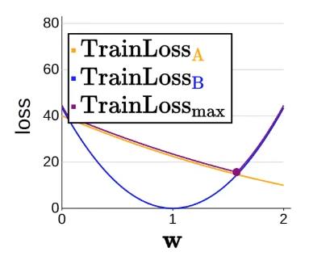
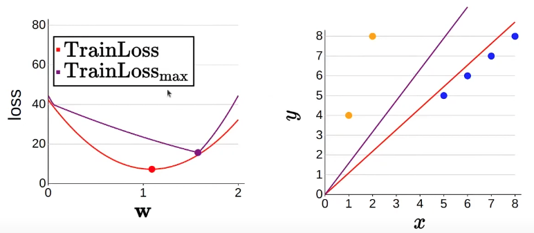
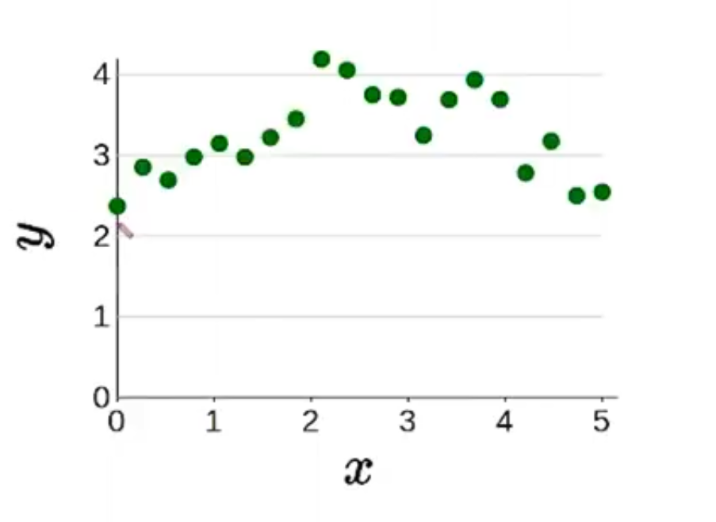
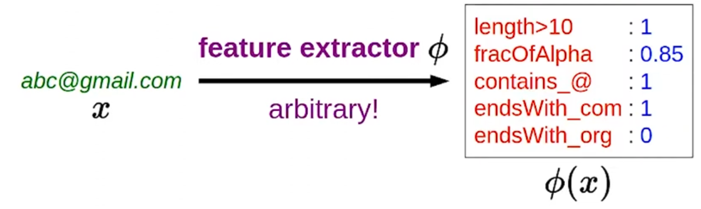
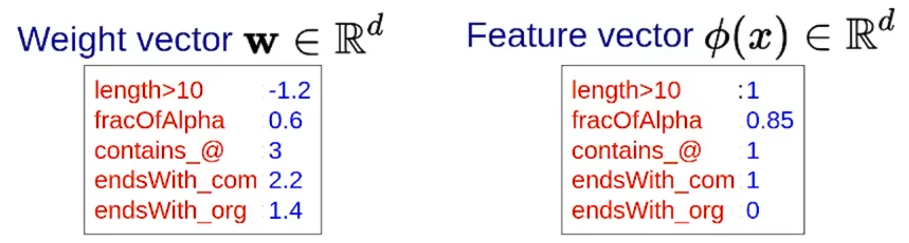
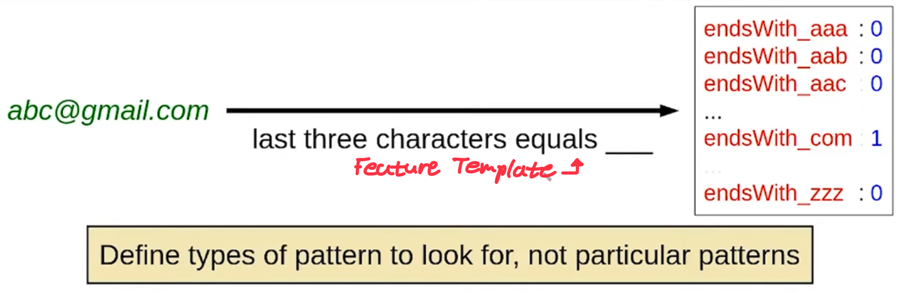
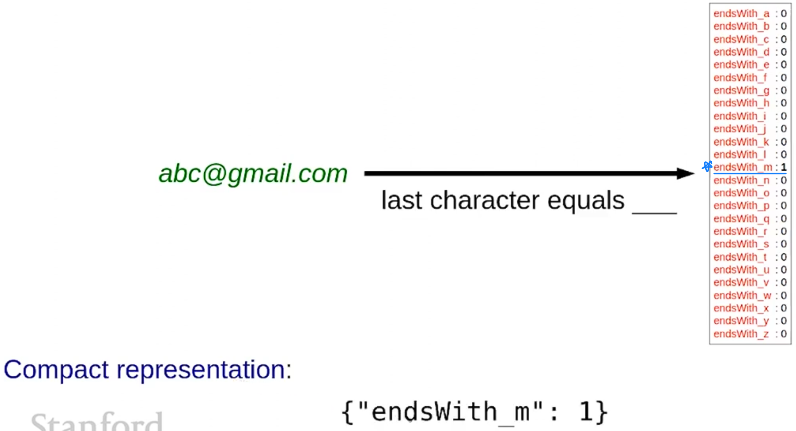
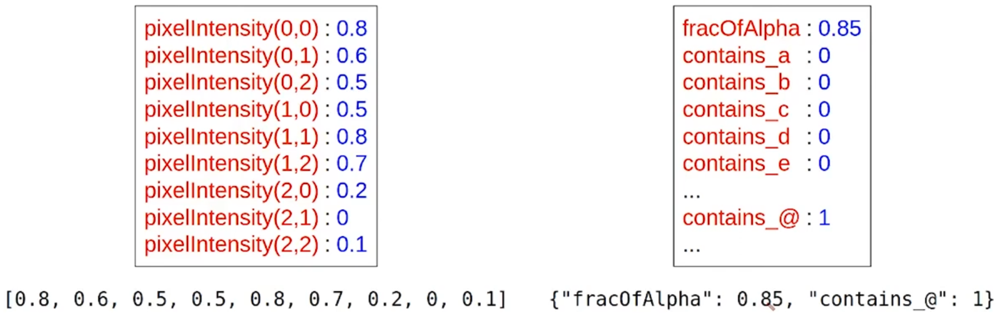

# LectureNote3: CS221 (FALL2021, Stanford)

## More About Optimization
### Stochastic Gradient Descent (SGD)
- gradient descent is slow
  - each iteration requires going over "all training examples" $\sum_{(x,y) \in D_{train}} Loss(x, y, w) \leftarrow$ expensive when have lots of data
 
- Algorithm: Stochastic Gradient Descent
  - initialize w = [0, ... ,0]
  - for t = 1, ... , T:
    - for $(x, y) \in D_{train}$
      - $w \leftarrow w - \eta \nabla_w Loss(x, y, w)$
  - instead of going through all training examples and performing **one** update, perform an update "after each example" $\rightarrow$ *frequent updates can lead to faster convergence*
  - in batch gradient descent, the gradient computation over the entire dataset can be computationally expensive, especially when the dataset is large. SGD reduces this computational burden by estimating the gradient using a single example or a small batch of examples.
    - this makes it particularly useful for large datasets and online learning scenarios, where new data is continuously available, and we need to update the model in real-time
  - stochastic gradient descent can escape local minima more effectively compared to batch gradient descent
    - it introduces noise into the optimization process by using a single example (or a random subset of data) to estimate the gradient, and the noise allows SGD to have a higher chance of escaping shallow local minima
  - trade off: each update is not high quality
    - It's not about *quality*, it's about **quantity**.
---
- Question: What should $\eta$ be?
  - small $\eta$
    - pros: conservative, more stable
    - cons: slow, might get stuck in local minima
  - big $\eta$ 
    - pros: aggressive, faster
    - cons: might overshoot the minimum, leading to divergence or oscillation
- Strategies:
  - constant: $\eta$ = 0.1
  - decreasing: $\eta$ = $\frac{1}{\sqrt{number \ of \ updates \ made \ so \ far}}$
---

### Group DRO
- Inequalities between different groups arise in machine learning because the goal of optimization is to minize the **average loss**
 
- Linear regression with groups
$\begin{matrix} x & y & group \\ 1 & 4 & A \\ 2 & 8 & A \\ 5 & 5 & B \\ 6 & 6 & B \\ 7 & 7 & B \\ 8 & 8 & B \\ \end{matrix}$
  - predictor $f_w(x) = w \cdot \phi(x)$ does not use the group information
  - Neither $TrainLoss(w)$ nor $Loss(w)$ uses group information
 
- Per-group loss
  - $TrainLoss_g(w) = \frac{1}{|D_{train}(g)|}\sum_{(x,y) \in D_{train}(g)}Loss(x,y,w)$
    
  - **Disparity** in loss between different groups
    - For w = 1
      - $TrainLoss_A(1) = 22.5$
      - $TrainLoss_B(1) = 0$
 
- Maximum group loss
  - $TrainLoss_{max}(w) = max_g \ TrainLoss_g(w)$
    - $TrainLoss_{max}(1) = max(22.5, 0) = 22.5$
 
- Average group loss vs Maximum group loss
  
  
  - Standard learning: minimizer of average loss $w = 1.09$
    - linear regression can result in a biased line that tilts towards a larger size group
  - Group distributionally robust optimization (Group DRO): minimizer of maximum group loss $w = 1.58$
    - treats groups more equally regardless of the size of each group
 
- Training via gradient descent: **minimize the maximum group loss**
  - $TrainLoss_{max}(w) = max_g \ TrainLoss_g(w)$
  - $\nabla TrainLoss_{max}(w) = \nabla TrainLoss_{g^*}(w)$
    - $g^* = \underset{g}{argmax} TrainLoss_g(w)$
  - we cannot use SGD because it's a sum over terms, but this is a maximum over a sum
 
- Possible Issues: intersectinality? don't know groups? overfitting?
 
### Non-Linear Features
- How do we fit a non-linear predictor? *change feature vector $\phi$*
 
  1. Qudratic predictors 
       - $\phi(x) = [1, x, x^2]$
       - $F = \{f_w(x) = w \cdot \phi(x): w \in \R^3\}$
       - ex) $f(x) = [2, 1, -0.2] \cdot \phi(x) = 2 + x-0.2x^2$
  2. Piecewise constant predictors
      - partitioning the input space
      - $\phi(x) = [1[a<x\leq b], 1[c<x\leq d], 1[i<x\leq j], 1[k<x\leq l]]$
      - $F = \{f_w(x) = w \cdot \phi(x): w \in \R^4\}$
      - ex) $f(x) = [1,2,4,3] \cdot \phi(x)$
  3. Predictors with periodicity structure 
     - $\phi(x) = [1, x, x^2, cos(3x)]$
     - $F = \{f_w(x) = w \cdot \phi(x): w \in \R^4\}$
    
- **You can just throw in any features you want!**
- Key idea: non-linearity
  - Expressivity: score $w \cdot \phi(x)$ can be a **non-linear** function of $x$
  - Efficiency: score $w \cdot \phi(x)$ always a **linear** function of $w$ 
---
- Linear in What? **Non-linear predictors with linear machinery**
  - Prediction: $f_w(x) = w \cdot \phi(x)$
    - Linear in $w$? *Yes*
    - Linear in $\phi(x)$? *Yes*
    - Linear in $x$? **Not always!**
- This approach allows us to apply the principles, methods, and algorithms developed for **linear predictors** to more complex or **non-linear** problems by utilizing a linear model in a transformed feature space
- Linearity in vector
  1. Homogeneity: $f(\alpha \vec{v}) = \alpha f(\vec{v})$
  2. Additivity: $f(\vec{v} + \vec{w}) = f(\vec{v}) + f(\vec{w})$
  - *The dot product operation* **preserves linearity** due to its inherent properties
    1. Homogeneity: $(\alpha v) \cdot w = \alpha (v \cdot w)$
    2. Additivity: $(v + u) \cdot w = (v \cdot w) + (u \cdot w)$  
---

### Non-Linear Classifier
  - Quadratic classfiers
      - $\phi(x) = [x_1, \ x_2, \ x_1^2 + x_2^2]$
      - $f(x) = sign([2, 2, -1] \cdot \phi(x))$
      
      - $f(x) = \begin{cases} 1 & if (x_1 - 1)^2 + (x_2 - 1)^2 \leq 2 \\ -1 & otherwise \end{cases}$ 
      - decision boundary is a circle
 - Visualization in feature space (transforming feature space)
      - Input space: $x = [x_1, \ x_2]$, decision boundary is a circle
      - Feature space: $\phi(x) = [x_1, \ x_2, \ x_1^2 + x_2^2]$, decision boundary is a line (curve in this example)
 
### Feature Templates
- $F = \{f_w(x) = sign(w \cdot \phi(x)) : w \in \R^d\}$
  - Feature extraction: choose $F$ based on *domain knowledge*
  - Learning: choose $f_w \in F$ based on *data*
  - We want $F$ to contain good predictors but not be too big
- Feature extraction with feature names
  - Question: what properties of $x$ might be relevant for predicting $y$?
  - Feature extractor: Given $x$, produce set of (*feature name*, *feature value*) pairs
  
  - Prediction with feature names
   
    - Score: weighted combination of features
      - $w \cdot \phi(x) = \sum^d_{j=1}w_j\phi(x)_j$
      - each feature is providing a vote
      - if $w_j\phi(x)_j$ is positivie $\rightarrow$ voting in favor of positive classification
      - if $w_j\phi(x)_j$ is negative $\rightarrow$ voting in favor of negative classification
      - the magnitude of $w_j$ determines the strength of the vote
 
- Feature Templates: a group of features all computed in a similar way
  
  - examples of feature templates
    1. Last three characters equal___
    2. Length greater than___
    3. Fraction of alphanumeric characters
  
- Sparsity in feature vectors: most feature values are zero

 

- Two feature vector implemntations
  1. Arrays (good for dense features)
  2. Dictionaries (good for sparse features)

 
