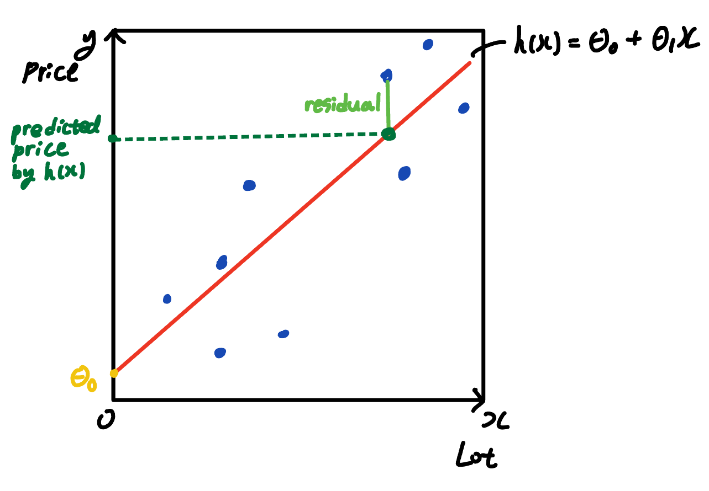

# LectureNote2: CS229 (SPRING2022, Stanford)

## Supervised Learning
### Set Up
- Prediction:
  - $h: \begin{matrix} x & \rightarrow & y \\ 
         images & & cat \\
         text & & hate \ speech? \\
         house data & & price
        \end{matrix}$
 
- Given: training set
  - $\set{(x^{(1)}, y^{(1)}), ..., (x^{(n)}, y^{(n)})}$
  - $y$ = supervision
 
- Do: find **good** $h(hypothesis): x \rightarrow y$
  - we care about **new** $x$'s that are not in our training set
  - if $y$ is *discrete* $\rightarrow$ Classification
  - if $y$ is *continuous* $\rightarrow$ Regression
  
- How do we represent $h$? 
  - $h(x) = \theta_0 + \theta_1x_1$
  
- Generalization
  - Training Set
$\begin{matrix}
 & size(x_1) & bedroom(x_2) & lot \ size(x_3) & ... & feature(x_d) &price(y) \\
 x^{(1)} & 2104 & 4 & 45k & ... & x^{(1)}_d & 400 \\
 x^{(2)} & 2500 & 3 & 30k & ... & x^{(2)}_d & 900 \\
 \vdots & \vdots & \vdots & \vdots & \vdots & \vdots & \vdots \\
 x^{(n)} & x_1^{(n)} & x_2^{(n)} & x_3^{(n)} & ... & x^{(n)}_d & y^{(n)} \\
\end{matrix}$ 
 
  
  - $(x^{(i)}, y^{(i)}) \leftarrow$ i-th training example
     
  - $\theta_{parameters}$ = $\begin{bmatrix} \theta_0 \\ \theta_1 \\ \vdots \\ \theta_d \end{bmatrix} \ \ \ \ x^{(i)}_{features}$ = $\begin{bmatrix} x^{(i)}_0 \\ x^{(i)}_1 \\ \vdots \\ x^{(i)}_d \end{bmatrix}$
  - $X_{train \ data} = \begin{bmatrix} -x^{(1)}- \\ -x^{(2)}- \\ \vdots \\ -x^{(n)}- \end{bmatrix} \in \R^{n (d + 1)} \ \ \ \ \ \vec{y}$ = $\begin{bmatrix} y^{(1)} \\ y^{(2)} \\ \vdots \\ y^{(n)} \end{bmatrix}$
    - $X_{train \ data}$ does not contain $y$'s
    - +1 is the extra dimension $x_0$, the intercept term, whose value is set to be 1
   
  - $h_{\theta}(x) = \theta_0x_0 + \theta_1x_1 + ... + \theta_dx_d \ = \sum^d_{j=0}{\theta_jx_j} \ (x_0 = 1),$ I want $h_{\theta}(x) \simeq y $
    
  - $J(\theta)_{cost \ function} = \frac{1}{2}\sum^n_{i = 1}{(h_{\theta}(x^{(i)}) - y^{(i)})^2}_{least \ squares}$ = $\frac{1}{2}(X\theta - \vec{y})^T(X\theta - \vec{y})$
    - $\frac{1}{2}$ is for convenience purpose (It cancels out with 2 when we take the derivative)
    - we only care about the minimizer, which is the $\theta$ that minimizes $J(\theta)$. The "actual value" of $J(\theta)$ is not important. 
    - This process is called "Optimization"
    
  - Gradient Descent with Matrix Operations
    - $\nabla_{\theta}J(\theta) = \nabla_{\theta}\frac{1}{2}(X\theta - \vec{y})^T(X\theta - \vec{y}) \\ = \frac{1}{2}\nabla_{\theta} \ ((X\theta)^TX\theta \ - \ (X\theta)^T\vec{y} \ - \ \vec{y}^T(X\theta) \ + \ \vec{y}^T\vec{y}) \\ = \frac{1}{2}\nabla_{\theta} \ (\theta^T(X^TX)\theta \ - \ \vec{y}^T(X\theta) \ - \ \vec{y}^T(X\theta)) \\ = \frac{1}{2}\nabla_{\theta} \ (\theta^T(X^TX)\theta \ - \ 2(X^T\vec{y})^T\theta) \\ = \frac{1}{2}(2X^TX\theta - 2X^T\vec{y}) \\ = X^TX\theta - X^T\vec{y}$
    - we want $X^TX\theta - X^T\vec{y} = 0 \ \rightarrow \ X^TX\theta = X^T\vec{y}$
    - $\therefore \theta = (X^TX)^{-1}X^T\vec{y}$
    - if $X$ is non-invertible, it means that there are redundant features, which can result in multicollinearity, or linearly dependent examples.
   
  - Batch vs Stochastic Minibatch
    - Batch: the whole training set
    - Minibatch: randomly select a small subset B of the training data (B << n)
    - calculate a noisy estimation $\theta^{(t + 1)} = \theta^{(t)} - \alpha_B \sum_{i \in B}{(h_{\theta}(x^{(i)}) - y^{(i)})}x^{(i)}$